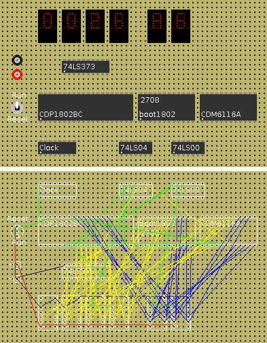

# Jdce
Digital Circuit Emulator written in Java

---
- [General Description](#general)
- [Quick Tutorial](#quick-tutorial)

---
## General
Digital Circuit Emulator (DCE)

by Michael H. Riley

DCE stands for Digital Circuit Emulator.  This program contains
the code for emulating a large number of TTL (7400 series), CMOS
(4000 series), and a number of other integrated circuits (chips).
This program allows you to put together electronic circuits and
test them without the need to hardwire the actual circuit.  DCE
also provides an excellent platform for learning Digital Electronics
because experimentation is so easy.

DCE operates in one of two primary modes: EDIT and RUN.
The program starts out in EDIT mode where you can place parts and
wire them together. You can enter RUN mode through the "Circuit/Run"
menu item.  The "Circuit/Run" menu item is a toggle and it will
switch between the two modes.

### EDIT MODE:

The edit mode is used to build your circuit.  In this mode parts
can be placed, wires connected and digi-scope probes attached or
removed.

### RUN MODE:

The run mode is used to simulate your circuit. In this mode all
of the parts will become active and some will become interactive.

### FILE Menu:

**NEW** - This command will erase the current circuit.

**LOAD** - This command will allow you to load a previously saved
circuit.  A file access box will be displayed on the screen show
ing the available circuit files.

**SAVE** - This command will allow you to save the current circuit.
The SAVE command will save to the last file either opened or
saved. If no file has been opened or saved, then it will ask
for a file name for saving.

**SAVE AS** - This command will allow you to choose a file to save
the current circuit. The file access box will be displayed and
selection of a save file can be performed.

### CIRCUIT Menu:

**RUN** - This command turns on the power to your circuit.	The circuit
will be flipped right-side up and the RUN mode is started.  See the
section on RUN mode for operation of this mode.

**STATUS** - This command will show the current status of the circuit.
How many parts, wires, and nets will be shown.  The run statistics
for the last run will also be shown.

**CHECK** - This command will perform several simple checks on your
circuit.  The purpose of these checks are to look for simple
wiring errors.

**SCOPE** - This command turns on and off the digiscope.  When the digi-
scope is enabled, the traces for all connected probees will be
displayed.

**PART** - This command is used for placing new parts in your circuit.
When selected a menu of device groups will appear.  All the devices
in DCE are placed together in common groups.  Select the group you
require and the menu will be replaced with all the parts available
in that group.	Click on the part you need and the menus will go
away and the cursor will change to a picture of a hand.  Click on
the hole where you want to place the chip.  The hole that is selected
is where pin 1 of the device will be placed.  When placing custom
chips, the file access box will appear with the names of all the
custom chips that are available, select the chip you wish to use and
then the cursor will change to the placement cursor.

**DATA** - This command brings up the parts menu for accessing on-
line data sheets.  This menu works exactly like the PART function
menu.  When a device is selected the data sheet for the part will
be displayed on the screen.

**WIRE** - This command allows you to change the color in which wires
are drawn.

### CHIP FUNCTIONS MENU:
When any pin of a placed part is clicked, a menu appears allowing
you to select options for this part as described below.

**ADD WIRE** - This option allows you to connect a wire from the
selected pin to another pin.  When selected the cursor will change
to a hand.  Click on the other pin you want to connect the wire to.

**CUT WIRE** - This option allows you to remove a connection on
the selected pin.  When selected the cursor will change to a cross.
Click on the pin on the other side of the wire to remove the wire.

**MOVE PART** - This option will allow you to move an already placed
part.  When selected the cursor will change to the hand cursor.
Click on the hole where you want to move the chip to.

**DELETE PART** - This option will delete the selected part as well
as all wires and probes conneceted to the selected part.

**ADD PROBE** - This option connects a digi-scope probe to the selected
pin.  Pins with digi-scope probes attached have their circles filled in.

**REMOVE PROBE** - This option removes a digi-scope probe from the
selected pin.

**SHOW NET** - This command will re-draw the circuit board, but only
show the wires that have a signal path to the selected pin.

**SHOW ALL** - This command resets the viewer to display all wires.

**DATA SHEET** - This command will call up the data sheet for the selected
part.

### RUN MODE:

The run mode flips the circuit board right-side up and then applies
power to the circuit.  In this mode switches can be manipulated and
output can be seen if output devices exist in the circuit.

While a circuit is running any switch can be changed just by
clicking on the switch.	 Buttons will remain pressed only as long
as the mouse button is held down over the button.  Dip switch
settings can also be changed.  Note: Dip switch settings will
always remain in the state they were last set.  When a circuit is
saved, any dip switch settings will also be saved.

### NOTES:

1.    You do not need to connect the GND or VCC connections of
any chips.  These connections are placed on an internally used
Net.  You also cannot get power from these pins, If you need GND
or +5v then place a power-supply part.

2.    Due to the way that wiring nets are resolved you must be
careful how you use switches.  Technically switches do not have
inputs and outputs, but in DCE the wiring nets only work with
inputs and outputs, therefore the switches have been altered to
work with DCE's wiring scheme.  On a switch, the inputs will have
SQUARE pins while the outputs will have the usual CIRCLE pins.
The normal position of a switch is indicated with a line going
between the center pin and the normal pin.

3.    LEDs have a line located near the Cathode (-) end.  Both
leads of an LED must be connected for the LED to work.  Pin 1
of an LED is the cathode.

4.    Unlike previous versions of DCE, the anode connection of the
TIL311 and MAN10A parts must be connected for the LED portion of
the part to function.

5.    The 74LS47 has a peculiar mode when it comes to this simulation.
If you use the RBI then you must have a connection on the RBO/BI
connection for proper operation.  If you do not make a connection here,
then when the display is blanked, it will not unblank.

## QUICK TUTORIAL

In this tutorial we will build a few simple circuits.
First we need to learn about pin numbers so that wires can be properly
connected.  On all chips there is a small dot near pin 1.  When in the
edit mode, this dot appears in the upper left corner of the chip because
the chip is being viewed from below.  In the run mode, the dot appears
in the lower left because it's viewed from above.  The pin numbers then
move along the same side of the chip.  Pin 2 will be just to the right
of pin 1.  When we get to the end we move to the opposite side of the
chip and start moving leftwards assigning pin numbers.  Below is a
sample chip showing the pin numbers:

      8  7  6  5
      |  |  |  |
    +-+--+--+--+-+
    |            |
    |.           |
    +-+--+--+--+-+
      |  |  |  |
      1  2  3  4

The two display chips (MAN10a, and TIL311) appear vertically on
the screen and the pin 1 will appear in the lower left on these
chips in the edit mode.	 On switches (but not DIP switches) pin 1
is towards the top in the edit mode.  DIP switches are numbered
the same as chips.

  Now lets build a circuit.  Just follow the steps below:

1. Pull down the PARTs menu and select 'GATES'.

2. Select the 74LS08 (third from the top).

3. The cursor will change to a hand or a small picture of chip with
   a small arrow pointing upwards to the left.  This is called the
   placement cursor.  Click on a hole near the middle of the screen
   and a 74LS08 part will appear on the screen.  Look for pin 1,
   remember it is in the upper left corner of the chip and is marked
   with a white dot.

4. Pull down the PARTs menu and select 'SWITCHES'.

5. Select the 'SWITCH SPDT 2-IN 1-OUT'. This is the second one on
   the list.

6. Place this part about 6 or 7 holes below the 74LS08.
   Take a close look at this part.  Notice in the center there is a
   round pin and above and below there are square ones.  In DCE the
   round switch pin represents the output from the switch and the
   square ones represent inputs.  Also note that there is a line
   connecting the center pin with the square pin on the top.
   This line represents the normal position of the switch (the
   position the switch is in when the circuit is turned on).

7. Get one more of the same switches and place it below the
   74LS08 and about 5 holes left or right from the first switch.

8. Pull down the PARTs menu and select 'POWER SUPPLY'.

9. Place the power supply part to the left of the 74LS08.
   Notice that near one pin of the power supply there is a minus (-)
   sign, this represents the ground pin of the circuit.  Next to the
   other pin is a plus (+) sign, this represents the +5v supply.

10. Pull down the PARTs menu and select 'OUTPUT DEVICES'

11. Select any color of LED. and place it directly above
    the 74LS08 about 6 or 7 holes away.

12. Pull down the WIRE menu.  This menu lets you change the
    colors of wires.  Select black.  We are going to place some
    ground wires, which are typically black.

13. Click on the negative pole of the power supply (the one
    with the minus sign).  A menu will appear. Select 'ADD WIRE'.
    The cursor will now change to either a picture of a
    soldering iron or possibly a hand.

14. Click on pin 1 of one of the switches (remember pin 1 on
    switches is towards the bottom of the screen in Edit mode).
    A black wire will be drawn between the power supply ground
    terminal and the switch.

15. Now connect pin 1 of the switch above with pin 1 of
    the other switch.

16. Now connect a wire from the negative power supply to the
    cathode of the LED.  The cathode can be identified by a small
    line that appears closer to the top pin.  Therefore the wire
    should be connected to the top pin.

17. Pull down the WIRE menu and select RED.  We are now going to
    add some positive power connections which are typically red.

18. Place a wire between the positive pole of the power
    supply (the pin with the plus sign) and pin 3 of one of the
    switches. Pin 3 will be the pin towards the top of the screen
    in Edit mode.  Remember pin 1 was on the bottom.

19. Connect pin 3 of the switch above with pin 3 of the
    other switch.

20. Pull down the WIRE menu and select BLUE.

21. Connect a wire from pin 2 of one of the switches to pin 1 of
    the 74LS08.  Remember pin 1 of the 74LS08 is marked by a white dot.

22. Connect a wire from pin 2 of the other switch to pin 2
    of the 74LS08.

23. Connect a wire from pin 3 of the 74LS08 to the anode
    of the LED. Remember the cathode was the pin with the line near
    it which appears towards the top of the screen, therefore the
    anode is the pin towards the bottom of the screen.

This circuit is now completed.	Turn the power to the circuit on
by using the CIRCUIT/RUN menu option.  The circuit board will now
be flipped right side up. Both switches will be in the down position
and the LED will not be lit.

Turn on a switch by clicking on the white part of the switch.  The
switch will change to the up position, the LED will still be off.
Now turn on the other switch and the LED will turn on. In this circuit
the LED will only light when switch 1 AND switch 2 are in the ON
(or up) position.  This circuit is therefore called an AND gate.
